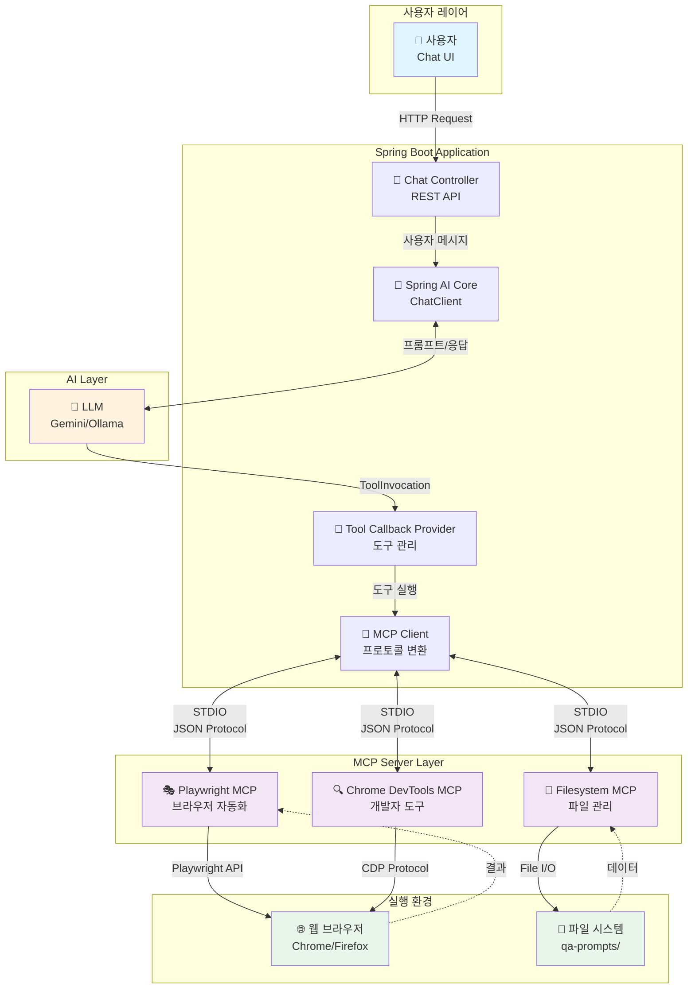
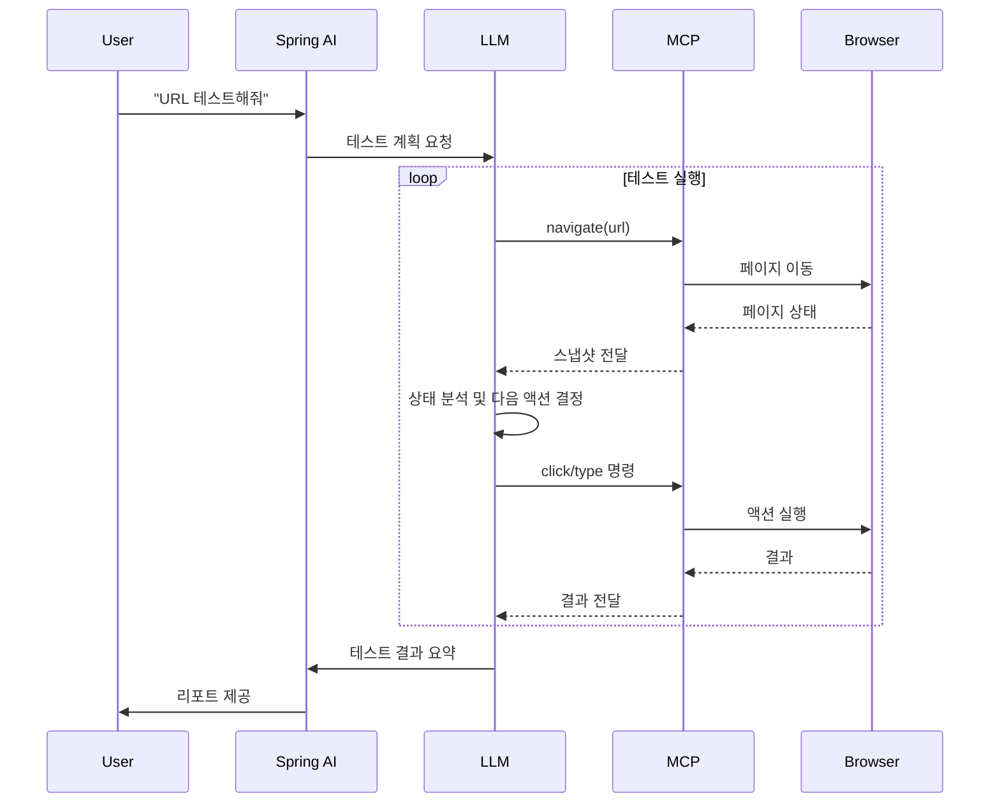

# QA Agent Server: AI 기반 웹 테스트 자동화

> 프로젝트 레파지토리 https://github.com/GeonDev/auto-tester-with-ai

## 프로젝트 개요

### 핵심 가치
AI가 자연어 요청을 받아 웹 브라우저를 직접 조작하며 테스트를 수행하고 결과를 보고하는 시스템

**한 줄 요약**: "이 페이지 로그인 테스트해줘" → AI가 브라우저를 열고 테스트하고 결과 리포트 제공

### 기술 스택
- **Framework**: Spring Boot 3.4.1 + Spring AI
- **LLM**: Google Gemini 2.5 (Flash/Pro), Ollama (Llama 3.2)
- **Browser Automation**: Playwright
- **Protocol**: MCP (Model Context Protocol)

---

## 1. 아키텍처

### 전체 구조


### 핵심 컴포넌트

#### 1.1 Spring AI Integration
- **ChatClient**: LLM과의 통신 추상화 레이어
    - 멀티 LLM 지원 (Gemini, Ollama 간 손쉬운 전환)
    - 스트리밍 응답으로 실시간 테스트 진행 상황 표시
    - Tool Invocation 파싱으로 LLM 의도 해석

- **Model Management**: 동적 모델 선택 및 최적화
  ```yaml
  # application.yml
  spring.ai.google.genai:
    model: gemini-2.5-flash      # 속도 우선
    temperature: 0.3              # 일관성 있는 테스트 결과
  ```

- **Tool System**: LLM의 외부 도구 활용
    - Java 메서드를 LLM 도구로 자동 변환
    - LLM이 자율적으로 필요 도구 선택 및 실행
    - 무한 확장 가능한 플러그인 구조

#### 1.2 MCP (Model Context Protocol)
LLM과 외부 시스템 간 표준화된 통신 프로토콜

**구조**:
```
Spring AI → MCP Client → [STDIO] → MCP Server → Playwright/Filesystem
```

**장점**:
- ✅ 보안: 격리된 프로세스, 최소 권한 원칙
- ✅ 확장성: 새로운 도구를 MCP Server로 추가 가능
- ✅ 안정성: STDIO 기반 프로세스 간 통신

**통합된 MCP 서버**:

| 서버 | 기능 | 제공 도구 수 |
|------|------|-------------|
| Playwright | 브라우저 자동화 | 33 |
| Filesystem | 파일/디렉토리 관리 | - |
| Chrome DevTools | Chrome 개발자 도구 | 26 |

---

## 2. 동작 원리

### 테스트 실행 흐름


### LLM의 자율적 의사결정
1. **상황 인식**: 페이지 스냅샷 분석
2. **판단**: 다음 테스트 단계 결정
3. **실행**: 적절한 도구 선택 및 호출
4. **검증**: 결과 확인 및 다음 단계로 진행/종료 판단

---

## 3. 시스템 프롬프트: AI의 행동 지침

LLM에게 QA 엔지니어로서의 역할과 작업 방식을 정의:

```
역할: 웹 애플리케이션 QA 전문가
목표: 기능 동작 검증, 버그 발견, 사용성 평가

도구 사용:
- navigate: 페이지 이동
- click: 요소 클릭
- type: 텍스트 입력
- snapshot: 현재 상태 캡처

보고 형식:
1. 테스트 시나리오
2. 실행 단계
3. 결과 (통과/실패)
4. 발견된 이슈
```

**중요성**: 프롬프트의 품질 = AI Agent의 성능

---

## 4. 빠른 시작

### 환경 설정
```bash
# 1. API 키 설정
export GEMINI_API_KEY=your-api-key

# 2. 빌드
./gradlew bootJar

# 3. Docker 실행
cd docker
docker-compose up -d

# 4. 접속
open http://localhost:8090
```

### 테스트 실행
```
채팅창에 입력:
"http://example.com/login 로그인 페이지 테스트해줘"
```

---

## 5. 핵심 설정

### application.yml 주요 구성
```yaml
spring:
  ai:
    # LLM 설정
    google.genai:
      api-key: ${GEMINI_API_KEY}
      chat.options:
        model: gemini-2.5-flash
        temperature: 0.3
    
    # MCP 통합
    mcp:
      client:
        sync-timeout: 60s
        stdio:
          connections:
            playwright:
              command: npx
              args: ["--yes", "@playwright/mcp@latest"]
            
            filesystem:
              command: npx
              args: ["--yes", "@modelcontextprotocol/server-filesystem", "${user.dir}/qa-prompts"]
            
            chrome-devtools:
              command: npx
              args: ["--yes", "chrome-devtools-mcp@latest"]
```

---

## 6. 향후 개선 방향

### 6.1 기능 확장
- [ ] 복잡한 사용자 여정 지원 (멀티 페이지 시나리오)
- [ ] 다양한 검증 로직 (데이터베이스, API 응답 등)
- [ ] 성능/부하 테스트 통합

### 6.2 안정성 강화
- [ ] 에러 복구 전략 (재시도, 대체 경로)
- [ ] LLM 의사결정 로깅 및 시각화
- [ ] 고급 프롬프트 엔지니어링 (Few-shot, CoT)

### 6.3 통합 및 자동화
- [ ] CI/CD 파이프라인 연동
- [ ] 다양한 브라우저/디바이스 지원
- [ ] 테스트 관리 시스템(Jira, TestLink) 연동

### 6.4 사용성 개선
- [ ] 시각적 테스트 리포트 (스크린샷, 비디오)
- [ ] 모니터링 대시보드
- [ ] 자연어 기반 테스트 케이스 자동 생성

---

## 7. 기술적 인사이트

### LLM의 도구 사용 메커니즘
```
사용자 입력 → LLM 분석 → 필요 도구 판단 → ToolInvocation 생성
→ MCP Client 변환 → MCP Server 실행 → 결과 반환 → LLM 해석
→ 다음 액션 결정 or 종료
```

### MCP의 가치
- **표준화**: 모든 외부 도구를 동일한 방식으로 통합
- **안전성**: LLM의 도구 접근을 통제된 환경에서 실행
- **확장성**: 새로운 도구를 플러그인처럼 추가

### Spring AI의 강점
- **추상화**: LLM 제공자 간 투명한 전환
- **통합**: Spring Boot 생태계와 자연스러운 결합
- **도구 시스템**: Java 메서드를 LLM 도구로 자동 변환

---

## 주의사항

⚠️ **보안**: API 키는 반드시 환경 변수로 관리  
⚠️ **Docker**: 호스트 접근 시 `host.docker.internal` 사용  
⚠️ **디버깅**: Headless 모드 해제 시 `--headed` 옵션 추가  
⚠️ **성능**: temperature 값은 테스트 일관성을 위해 낮게 유지 (0.3 권장)

---


